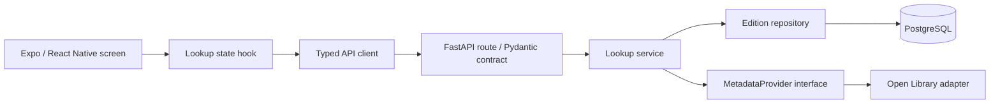
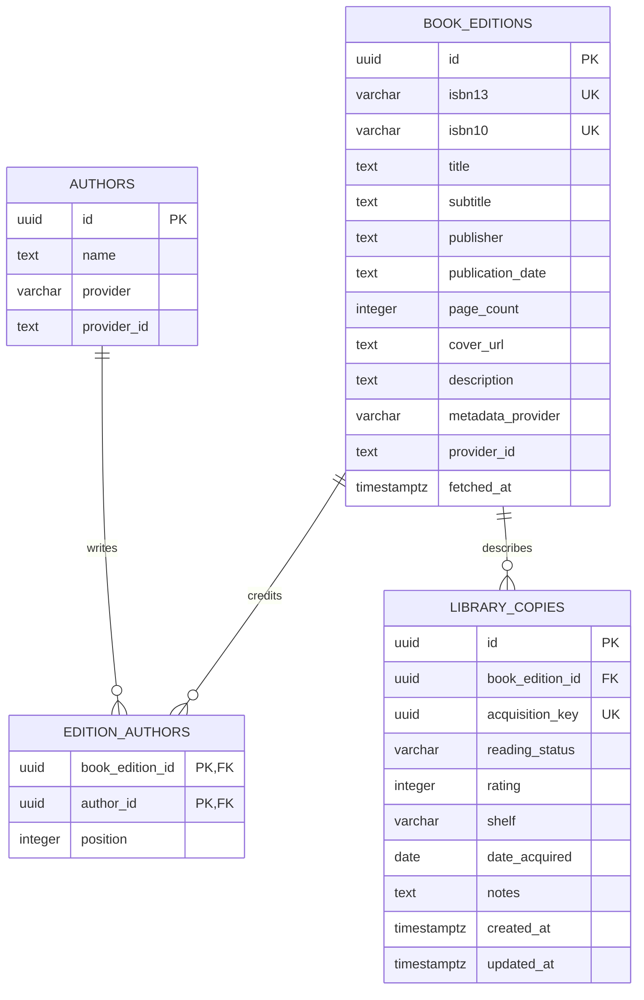

# Stacks architecture

Stacks catalogs physical copies while keeping shared edition metadata separate. Milestone 1 delivers lookup only: receiving a book record never implies ownership.

## Boundaries

Routes handle HTTP, services coordinate behavior, repositories handle persistence, and providers translate external data into `EditionMetadata`. An application-scoped HTTP client reuses connections; each request gets an isolated async SQLAlchemy session. Alembic owns the schema: application startup never runs `create_all`.

The mobile app uses a single screen rather than a navigation dependency for this milestone. `app/` holds screens, `components/` presentation, `hooks/` request state, `services/` transport, and `types/` generated contracts. OpenAPI generates TypeScript types; change the Pydantic schema, export OpenAPI, and regenerate client types together.

## Relational model

- ISBN-13 is the canonical cache key. Valid ISBN-10 converts to its equivalent 978 ISBN-13. A 979 ISBN has no ISBN-10 equivalent. Checksum validation happens before I/O; only whitespace and hyphens are removed.
- Edition UUIDs are internal identities. Provider identifiers remain provenance, not primary keys. This initial edition table requires an ISBN; cataloging books without ISBNs needs a later schema change.
- Author identity is unique by `(provider, provider_id)` when supplied. Unidentified authors receive distinct records, even when names match. An ordered association preserves credit order. Adding a fallback provider may create separate author identities until an explicit reconciliation workflow exists.
- Partial publication dates stay text, preserving values such as `1988` or `September 1988`. No invented January 1 dates. Multiple publishers are joined into one display field for this version; publishers need no identity table until there is publisher-specific behavior.
- Missing optional metadata stays null or an empty author list. Descriptions are plain text and may be absent from the Books API. The adapter only passes Open Library cover URLs and upgrades them to HTTPS; image failure produces a client placeholder.
- Database constraints enforce positive page counts, allowed reading states, rating 1–5, and unique ordered author positions. A null rating means unrated. Deleting an edition with copies is restricted; deleting a future copy will not delete cached bibliographic data.
- `updated_at` uses SQLAlchemy's update expression. Future copy updates must go through SQLAlchemy; direct SQL writers must set it explicitly. UUIDs are application generated.

## Lookup and caching

1. Validate/normalize the input.
2. Search PostgreSQL by canonical ISBN-13.
3. On a miss, query Open Library's `/api/books` with equivalent ISBN keys, `format=json`, and `jscmd=data`.
4. Translate the result to our schema; distinguish a missing record from an upstream outage.
5. Insert the edition and its authors in one transaction. PostgreSQL `ON CONFLICT` arbitrates simultaneous lookups; the first committed edition wins.
6. Return `{book, source}`. `source` is `cache` or `provider`, and `book.metadata_provider` identifies provenance. No `LibraryCopy` is created.

The provider list supports fallthrough on a missing record. Outages currently fail explicitly instead of silently falling through. A future fallback policy can change in the service without changing routes or the mobile app. There are no automatic retries, negative caching, or metadata expiration in this version. Positive metadata persists; refresh, provider throttling, and outbound concurrency limits are later hardening work. The local development API is unauthenticated and must not be exposed as a public shared service.

## Duplicate-copy policy for Milestone 2

`LibraryCopy.book_edition_id` is deliberately **not** unique. Each add operation will carry a client-generated `acquisition_key`; retrying that operation must return its existing copy. The same key with different content will return 409.

A separate operation for an already-owned edition will require an explicit `allow_duplicate` confirmation. The save transaction should lock the edition row, check existing copies, and return 409 with a confirmation prompt if needed. A newly confirmed operation with a new key may create another physical copy. A different ISBN is a different edition and is allowed. Cross-edition work matching is intentionally deferred. Only the key constraint exists in Milestone 1; no copy creation endpoint is exposed yet.

## HTTP contract

| Endpoint | Meaning |
| --- | --- |
| `GET /health` | Process liveness, 200 without contacting a database/provider |
| `GET /health/ready` | Database access and initial edition-table presence, 200 or 503 |
| `GET /books/lookup/{isbn}` | Validate, cache/read, and normalize one edition |
| `GET /docs` | Interactive OpenAPI documentation |

Lookup returns 200 on success, 422 for invalid input, 404 for an absent book, 502 for unavailable/malformed upstream responses, 503 for database unavailability or provider throttling, and 504 for provider timeout. Errors share `{ "error": { "code": "...", "message": "..." } }`. Unexpected failures return a generic 500. Error logs identify exception classes without leaking SQL parameters or credentials. Readiness checks initial schema presence, not provider health or migration drift; `alembic check` verifies model/schema agreement separately.

## UX direction

Charcoal surfaces, warm off-white text, muted sage accent, thin rules, restrained monospace labels, and small corner radii. Book covers supply color. System typography supports native rendering and scaling. The screen includes an idle state, example ISBN, loading state, timeout/network/provider/input errors, retry, missing-cover fallback, metadata preview, keyboard avoidance, safe areas, and a clear explanation that saving comes next. There are no fake library counts, nonfunctional scan controls, or simulated saved copies.

## Milestones

1. **Lookup foundation — implemented:** backend/config, models/migration, health/readiness, normalized cached lookup, tests, manual-entry Expo screen, generated types.
2. **Copy lifecycle — implemented in this slice:** review form, copy save/read endpoints, idempotent acquisition keys, duplicate confirmation, catalog endpoint, status filters, title/author search, and summary counts.
2. **Copy lifecycle:** request/response schemas and service; editable review; save with idempotency and duplicate confirmation; details; status/rating/shelf/acquisition date/notes; update/delete. Keep copy-specific edits out of global bibliographic metadata.
3. **Library browsing:** paginated cover grid, title/author search, reading-state filters, stable title/author/date-added/rating sorts, statistics, loading/empty/error states, immediate cache invalidation after mutations.
4. **Scanning:** Expo Camera permissions, ISBN barcode formats, debounce/pause after acquisition, review handoff, scan-again state, manual fallback. ISBN-10 remains accepted for manual input; retail ISBN barcodes usually encode ISBN-13.
5. **Release hardening:** real-device accessibility and integration checks, network resilience, operational logging/rate controls, deployment guide. If multi-user use is intended, add authentication, users, ownership foreign keys, and authorization tests before public deployment.

## References

- [Open Library Books API](https://openlibrary.org/dev/docs/api/books)
- [Open Library API usage guidance](https://openlibrary.org/developers/api)
- [Expo SDK compatibility](https://docs.expo.dev/versions/latest/)

Expo dependencies follow the official SDK 57 blank TypeScript template. The app uses TypeScript 6 from that template. API type generation is isolated in `tooling/api-types` with TypeScript 5 because the generator currently declares that peer range. No forced peer-resolution override is used.
